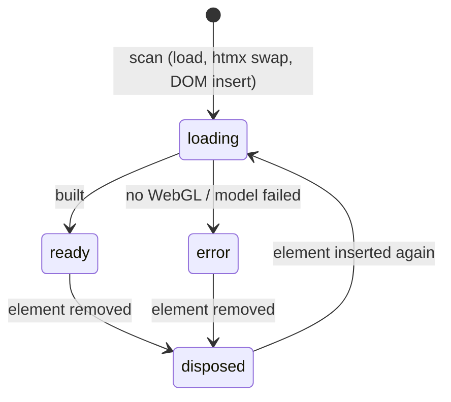

# autumn-plugin-three

[Three.js](https://threejs.org) 3D scenes for [Autumn](https://autumn-web.app)
apps, with Maud + htmx ergonomics. There is no npm, no bundler, and no inline
script. Write the scene in Rust or as HTML attributes. Scenes work in htmx
partials.

- Three.js **0.185.1** (MIT), vendored and pinned by `sha384`.
- Requires `autumn-web` **0.8**. MSRV **1.88**.

## Quickstart

Add the plugin:

```rust
use autumn_plugin_three::ThreePlugin;

autumn_web::app()
    .plugin(ThreePlugin::new())
    .run()
    .await;
```

Put the tags in the layout `<head>`:

```rust
use autumn_plugin_three::{three_script, three_stylesheet};

html! {
    head {
        (three_stylesheet())
        (three_script())
    }
}
```

Write a scene:

```rust
use autumn_plugin_three::{Color, Controls, Environment, Mesh, Scene};

html! {
    (Scene::new()
        .label("An orange torus knot")
        .environment(Environment::Room)
        .controls(Controls::OrbitNoZoom)
        .turntable(20.0)
        .add(Mesh::torus_knot(0.8, 0.25).color(Color::hex(0xff7a18)).metalness(0.6)))
}
```

## Model viewer

```rust
use autumn_plugin_three::{Controls, Environment, Model, Scene};

(Scene::new()
    .environment(Environment::Room)
    .controls(Controls::Orbit)
    .add(Model::gltf("/static/models/chair.glb").fit(2.0).play_all())
    .fallback(html! { img src="/static/chair.jpg" alt="A chair"; }))
```

`fit(size)` scales the model so its largest side is `size` and centers it.
`play_all()` or `play("Walk")` loops animation clips.

## htmx

The runtime scans each htmx swap. It also disposes a scene when htmx (or any
script) removes its element, so the GPU memory and the WebGL context are
freed:

```rust
#[get("/shape")]
async fn shape() -> Markup {
    html! { (Scene::new().add(Mesh::dodecahedron(0.9).spin([0.0, 60.0, 0.0]))) }
}
```

```html
<button hx-get="/shape" hx-target="#gallery">Next shape</button>
```

## Your own JavaScript

Listen for `three:ready`. The event detail is the scene handle. Register the
listener in a script that loads before `DOMContentLoaded` (a module or
`defer` script). A later script can read `element.autumnThree` instead.

```js
document.addEventListener("three:ready", (event) => {
  const { THREE, scene, camera, renderer, root, requestRender } = event.detail;
  // Add objects, raycast, change materials, then:
  requestRender();
});
```

Import Three.js only from the plugin URL, so you share one instance:

```js
import * as THREE from "/static/_plugins/three/three.module.min.js";
```

| Handle field | Meaning |
|---|---|
| `THREE` | The Three.js module. |
| `scene`, `camera`, `renderer` | The scene objects. |
| `root` | Group that holds meshes and models. The turntable turns it. |
| `controls` | `OrbitControls`, or `null`. |
| `models`, `mixers` | Model groups and animation mixers. |
| `render()` | Renders one frame now. |
| `requestRender()` | Renders one frame on the next animation frame. |
| `looping` | `true` while the animation loop runs. |

## Attribute reference

The builder renders these attributes. You can also write them by hand.
Angles are degrees. Speeds are degrees per second. A bad value uses the
default and the runtime logs a warning for a bad declaration.

### Scene (`data-three="scene"`)

| Attribute | Values | Default |
|---|---|---|
| `data-three-aspect` | `16/9`, `4/3`, `1/1`, `21/9`, `3/2`, `3/4`, or any `w/h` | `16/9` |
| `data-three-background` | `#rrggbb`, `#rgb` | transparent |
| `data-three-camera` | camera position `x,y,z` | `0,1,4` |
| `data-three-target` | look-at point `x,y,z` | `0,0,0` |
| `data-three-fov` | degrees, `1`–`179` | `50` |
| `data-three-controls` | `none`, `orbit`, `orbit-no-zoom` | `none` |
| `data-three-environment` | `room` | none |
| `data-three-turntable` | degrees per second around Y | `0` |
| `data-three-reduced` | `animate`: keep motion for reduced-motion users | — |

Child `<div data-three-fallback>`: shows without JavaScript, without WebGL,
and when a model fails.

### Mesh (`data-three-mesh`)

| Attribute | Values | Default |
|---|---|---|
| `data-three-mesh` | `box`, `sphere`, `plane`, `torus`, `torus-knot`, `cylinder`, `cone`, `capsule`, `icosahedron`, `dodecahedron`, `octahedron`, `tetrahedron`, `ring` | — |
| `data-three-args` | sizes, comma-separated (see below) | per kind |
| `data-three-material` | `standard`, `physical`, `basic`, `lambert`, `phong`, `normal` | `standard` |
| `data-three-color` | `#rrggbb` | `#ffffff` |
| `data-three-emissive` | `#rrggbb` | `#000000` |
| `data-three-metalness` | `0`–`1` | `0` |
| `data-three-roughness` | `0`–`1` | `0.5` |
| `data-three-opacity` | `0`–`1` | `1` |
| `data-three-wireframe` | `true` | `false` |

Sizes: `box` w,h,d (`1,1,1`) · `sphere` r (`0.5`) · `plane` w,h (`1,1`) ·
`torus` r,tube (`0.5,0.2`) · `torus-knot` r,tube (`0.5,0.15`) · `cylinder`
top,bottom,h (`0.5,0.5,1`) · `cone` r,h (`0.5,1`) · `capsule` r,length
(`0.3,0.6`) · polyhedra r (`0.5`) · `ring` inner,outer (`0.25,0.5`).

### Model (`data-three-model`)

| Attribute | Values | Default |
|---|---|---|
| `data-three-model` | `.glb` / `.gltf` URL (`http(s)` or relative) | — |
| `data-three-fit` | largest side after scaling | no fit |
| `data-three-clip` | `*` (all clips) or a clip name | none |

### Mesh and model transform

| Attribute | Values | Default |
|---|---|---|
| `data-three-position` | `x,y,z` | `0,0,0` |
| `data-three-rotation` | degrees `x,y,z` | `0,0,0` |
| `data-three-scale` | `x,y,z` or one number | `1,1,1` |
| `data-three-spin` | degrees per second `x,y,z` | `0,0,0` |

### Light (`data-three-light`)

| Attribute | Values | Default |
|---|---|---|
| `data-three-light` | `ambient`, `directional`, `point`, `spot`, `hemisphere` | — |
| `data-three-color` | `#rrggbb` (sky color for `hemisphere`) | `#ffffff` |
| `data-three-ground` | `#rrggbb`, `hemisphere` only | `#444444` |
| `data-three-intensity` | `0` or more | per kind |
| `data-three-position` | `x,y,z` | per kind |

A scene with no light and no environment gets a hemisphere light and a
directional light.

### Events and states

| Name | Meaning |
|---|---|
| `three:ready` | The scene renders. `detail` is the handle. Bubbles. |
| `three:error` | WebGL or a model failed. `detail` is `{ error, src }`. Bubbles. |
| `data-three-state` | `loading`, `ready`, `error`, or `disposed`. The runtime sets it. |



## Behavior

- **Reduced motion.** When the user prefers reduced motion, spin, turntable,
  and clips stop. Orbit controls still work. `animate_reduced_motion()` opts
  a scene back in.
- **Performance.** The animation loop runs only while the scene is visible
  and has motion. A static scene renders on demand. The pixel ratio is
  capped at 2.
- **Accessibility.** `label("…")` sets `role="img"` and `aria-label`. The
  canvas is `aria-hidden`.

## CSP

The plugin works under the default Autumn CSP and in nonce mode
(`[security.headers.csp_nonce] enabled = true`). There is no inline script,
no inline style, no import map, and no `eval`. Images inside a GLB work
under the default CSP.

htmx adds an inline `<style>` for its indicators. Nonce mode blocks it. Turn
it off in the layout:

```rust
meta name="htmx-config" content=r#"{"includeIndicatorStyles":false}"#;
```

## How it works

- `assets/` holds the vendored files and the plugin files. `THREE_ASSETS`
  serves them under `/static/_plugins/three/`. Hashed URLs are immutable.
  Plain URLs revalidate.
- Three.js is a set of ES modules. Module imports use plain URLs, so the
  page, the addons, and your code share one Three.js instance.
  `three_script()` preloads the core modules with SRI, then loads `init.js`
  at its hashed URL with SRI. See
  [ADR 0001](docs/adr/0001-esm-module-graph.md).
- The addons import the bare specifier `three`. `scripts/vendor.sh` makes the
  imports relative. A test reverses the rewrites and checks the upstream
  hash. See [ADR 0002](docs/adr/0002-addon-import-rewrites.md).
- `parse.js` reads the attributes. `init.js` builds and disposes scenes. See
  [ADR 0003](docs/adr/0003-declarative-scene-runtime.md).

## Demo

```sh
cargo run --example three_demo
# open http://127.0.0.1:3000
```

## Tests

```sh
cargo test                                # Rust unit, property, and doc tests
npm ci && npm run test:unit               # parse.js (node --test)
cargo build --example e2e_fixture
npm run test:e2e                          # Chromium + WebGL (SwiftShader)
```

The E2E suite reads real canvas pixels. It also runs in CSP nonce mode and
checks `init.js` line coverage (minimum 85 %).

## Limits

- WebGL only. No WebGPU renderer.
- No shadows, post-processing, or physics in the declarative layer. Use
  `three:ready` for custom code.
- Each scene has its own WebGL context. Browsers allow about 16 at a time.
- glTF 2.0 / GLB only. No Draco, KTX2, or Meshopt compression.
- External model and image URLs need a CSP that allows them.
- Upgrading Three.js means a new plugin release (`scripts/vendor.sh`).

## License

Apache-2.0. Three.js is MIT: see `assets/THREE-LICENSE`.
