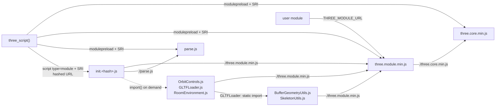

# ADR 0001: Load Three.js as an ES module graph at plain URLs

- Status: accepted
- Date: 2026-10-07
- Applies to: autumn-plugin-three 0.1.0, autumn-web 0.8.0

## Context

Three.js 0.160+ ships ES modules only (no UMD build). `three.module.min.js`
imports `./three.core.min.js`. A module import resolves against the URL of
the importing file. Autumn `PluginAssets` serves each file at a hashed URL
(`init.3f9a12c0.js`) and at a plain URL (`init.js`). A file cannot know the
hashes of other files at build time.

If one file imports Three.js at a hashed URL and another at the plain URL,
the browser loads two instances. Objects from one instance fail
`instanceof` checks in the other.

Dynamic `import()` and static imports take no `integrity` attribute.

## Decision

- The entry `init.js` loads at its hashed URL, with SRI.
- All module imports are relative. They resolve to plain URLs under
  `/static/_plugins/three/`. User code imports `THREE_MODULE_URL` (plain).
- `three_script()` emits `<link rel="modulepreload">` with SRI for the core
  graph (`three.core.min.js`, `three.module.min.js`, `parse.js`). The
  browser checks the bytes. The imports then use the preloaded modules.
- Addons load on demand with `import()`, at plain URLs, without SRI. They
  are same-origin bytes from the binary. `GLTFLoader.js` imports the two
  utility addons statically.
- `three_script()` must come before any page module that imports
  `THREE_MODULE_URL`. Else that import fills the module map first, without
  SRI.

## Consequences

- One Three.js instance per page. User code can extend scenes.
- The browser checks plain URLs again (`ETag`, `304`) at each page load.
  It does not check hashed URLs. This costs one round trip per module when
  the cache has the file.
- Addons have no SRI. The risk is low because they are same-origin bytes.
- During a rolling deploy, a page from version N can get plain-URL modules
  from version N+1. The SRI check then fails, and the scenes show their
  fallback until the page reloads.
- No import map, so the default CSP (`script-src 'self'`) allows all tags.
