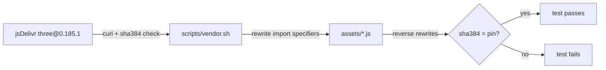

# ADR 0002: Rewrite addon import specifiers at vendor time

- Status: accepted
- Date: 2026-10-07
- Applies to: autumn-plugin-three 0.1.0

## Context

Three.js addons (`examples/jsm/*`) import the bare specifier `three`.
`GLTFLoader.js` also imports `../utils/*.js`. A browser resolves a bare
specifier only with an import map. An import map is an inline
`<script type="importmap">`. The default Autumn CSP (`script-src 'self'`)
blocks inline scripts. Browsers do not support external import maps.

Three.js 0.186 ships no minified builds. 0.185.1 is the newest release with
upstream-minified `three.core.min.js` and `three.module.min.js`.

## Decision

- Pin Three.js 0.185.1. Vendor the core files byte-exact.
- `scripts/vendor.sh` downloads each file, checks its `sha384`, and
  rewrites only import specifiers:
  - `} from 'three';` → `} from './three.module.min.js';`
  - `'../utils/X.js'` → `'./X.js'` (flat layout).
- `scripts/vendor.sh` stops when a rewrite does not match exactly one line.
- `VendoredFile::rewrites` lists each rewrite. A test reverses the rewrites
  and checks the upstream `sha384`. The test also checks that each rewrite
  changes only an import specifier to a bundled file. A second test checks
  that every module import in the bundle resolves to a bundled file.

## Consequences

- No import map. CSP stays strict.
- The served addon bytes differ from upstream. The provenance stays
  provable by test.
- A Three.js upgrade must update `vendor.sh`, `VENDORED`, and
  `manifest.json` together. Tests fail if they disagree.
