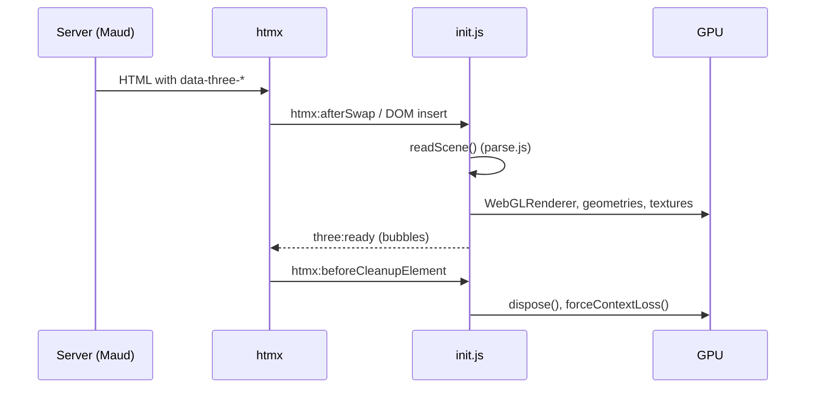

# ADR 0003: Declarative scenes with child declarations and a disposing runtime

- Status: accepted
- Date: 2026-10-07
- Applies to: autumn-plugin-three 0.1.0

## Context

Autumn renders HTML on the server. htmx swaps HTML fragments. A Three.js
scene is a JavaScript object graph that holds GPU resources. Browsers allow
about 16 WebGL contexts per page. A swapped-out scene that is not disposed
leaks its context.

## Decision

- A scene is one element: `
`. Scene options are
  attributes on it.
- Each object is a hidden child declaration: `data-three-mesh`,
  `data-three-model`, `data-three-light`. A JSON attribute was rejected:
  it is hard to write by hand and to diff.
- `parse.js` is pure. It turns markup into a config and never throws. Node
  tests cover it. `init.js` turns a config into Three.js objects.
- `init.js` scans on `DOMContentLoaded`, on `htmx:afterSwap`, and on DOM
  insertion (`MutationObserver`). The first scan waits for
  `DOMContentLoaded`, so later page modules get `three:ready`.
- A `Map` from element to state prevents a second build. Markup restored by
  htmx history can hold an old canvas; the build removes it.
- Disposal runs on `htmx:beforeCleanupElement` and when a removed element is
  not connected at the end of the mutation batch. A move (remove and insert
  in one task) keeps the scene.
- The loop runs only while the scene is visible (`IntersectionObserver`)
  and has allowed motion. Otherwise frames render on demand.
- `GLTFLoader` gets a plugin that decodes GLB-embedded images with
  `createImageBitmap(blob)`. The stock path fetches a `blob:` URL, which
  `connect-src 'self'` blocks.

## Consequences

- Scenes work in any htmx swap with no extra code.
- The runtime does not watch attribute changes on a live scene. To change a
  scene, swap it, or use the `three:ready` handle.
- The `GLTFLoader` plugin depends on `GLTFParser` internals of the pinned
  version. The E2E test of a textured GLB guards it.
